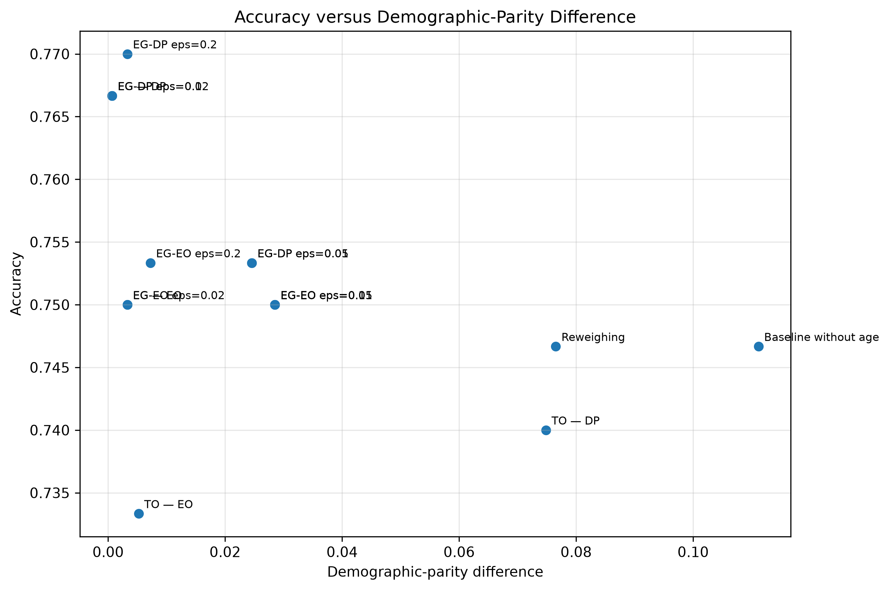
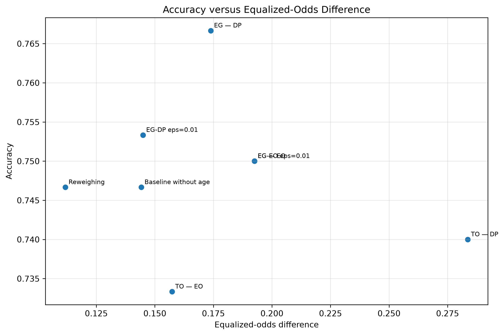

# Fairness in Credit-Risk Classification

**Group members:** Davis Joseph and Malone Mfono

**Institution:** Aivancity

**Professor:** Professor David Appadourai

**GitHub repository:** https://github.com/davisjoseph6/fairness-lab.git

## Introduction and methodology

This report audits fairness in a binary credit-risk classifier trained
on the German Credit dataset. The target is encoded as good credit = 1
and bad credit = 0. The sensitive attribute is age, divided into young
applicants, defined as age below 25, and old applicants, defined as age
25 or above.

The experiment studies three families of fairness. Demographic parity
belongs to independence and asks whether groups receive positive
predictions at similar rates. Equalized odds belongs to separation and
asks whether error rates are similar across groups conditional on the
true label. Positive predictive value and calibration belong to
sufficiency and ask whether a positive prediction means the same thing
across groups.

The notebook uses one fixed train/test split, one random seed, one
positive-class definition, and one age-group definition. Age is retained
separately for auditing even when it is removed from the predictive
features. This distinction is central to the lab: deleting a sensitive
column from the model is not the same thing as proving that the model no
longer produces group disparities.

## Repository and submission artifacts

The full project repository and submission artifacts are available here:

- Repository: https://github.com/davisjoseph6/fairness-lab.git
- Pre-computation commitments: https://github.com/davisjoseph6/fairness-lab/blob/main/00_commitments.md
- Runnable notebook: https://github.com/davisjoseph6/fairness-lab/blob/main/notebooks/fairness_lab.ipynb
- Exported notebook HTML: https://github.com/davisjoseph6/fairness-lab/blob/main/outputs/fairness_lab.html
- Output tables: https://github.com/davisjoseph6/fairness-lab/tree/main/outputs/tables
- Output figures: https://github.com/davisjoseph6/fairness-lab/tree/main/outputs/figures
- Final report PDF: https://github.com/davisjoseph6/fairness-lab/blob/main/report/fairness_report.pdf

## 1. Baseline disparity

Our pre-computation expectation was that applicants below 25 would be
disadvantaged and that deleting age would not eliminate the disparity.
The experiment supported that expectation.

In the baseline model with age included, the old group had a higher
base rate of good credit than the young group: 0.727 compared with
0.553. The model also selected old applicants more often: the old
selection rate was 0.771, while the young selection rate was 0.660,
giving a demographic-parity difference of 0.111.

The disadvantage was not limited to selection rate. The young group had
a lower true-positive rate, 0.731 compared with 0.870 for the old group,
meaning that creditworthy young applicants were less likely to be
approved. The young group also had a higher false-positive rate, 0.571
compared with 0.507, and a lower positive predictive value, 0.613
compared with 0.821. Therefore, the answer to "who is disadvantaged"
depends partly on the metric, but the young group is worse off on the
main opportunity and prediction-quality measures in this run.

Removing age from the predictive features did not solve the problem.
The demographic-parity difference remained exactly 0.111, and the
equalized-odds difference slightly worsened from 0.139 to 0.144. This
rejects the claim that a model cannot discriminate if it does not see
the protected attribute. In this dataset, other variables such as
employment, housing, credit duration, credit history, savings, and
foreign-worker status may plausibly preserve age-related information as
proxies. Removing age mostly removes the explicit variable; it does not
remove all age-related structure from the data.

## 2. Calibration and equal-error impossibility

Using the baseline model, we verified Chouldechova's identity separately
for the old and young groups. For the old group, the observed false
positive rate was 0.507246 and the right-hand side of the identity was
also 0.507246, with only floating-point error. For the young group, the
observed false positive rate was 0.571429 and the identity also returned
0.571429.

The base rates were not equal. The old group had a positive-class base
rate of 0.727273, while the young group had a base rate of 0.553191.
This difference matters because the identity links the false positive
rate to the base rate, the positive predictive value, and the false
negative rate.

To demonstrate the conflict numerically, we used the pooled baseline
PPV, 0.792035, as a common PPV value for both groups. Under that common
PPV, while holding the observed false negative rates fixed, the identity
forced the old group's FPR to 0.608858 and the young group's FPR to
0.237563. The resulting FPR gap was 0.371294.

Therefore, the conflict is not merely a bug in our classifier. It is a
counting relationship. When groups have different base rates, equal
calibration or equal PPV does not generally coexist with equal error
rates. A stakeholder demand for both equal calibration and equal FPR is
therefore mathematically incompatible in ordinary non-perfect settings.

## 3. Mitigation and fairness–accuracy frontiers

The mitigation results show that "make it fair" is not a complete
technical instruction. Each method changed a different fairness family.

The baseline model without age had accuracy 0.746667, demographic-parity
difference 0.111177, and equalized-odds difference 0.144231. Reweighing
kept the same accuracy, 0.746667, while reducing demographic-parity
difference to 0.076528 and equalized-odds difference to 0.111801. This
was the best equalized-odds result among the main methods.

Among the main named mitigation methods, ExponentiatedGradient with a
demographic-parity constraint produced the highest accuracy, 0.766667,
and almost eliminated the demographic-parity difference, reducing it to
0.000673. In the epsilon sweep, the related EG-DP eps=0.2 point reached
accuracy 0.770000 with demographic-parity difference 0.003280, but its
equalized-odds difference remained 0.173913. This reinforces the same
trade-off: the strongest demographic-parity points did not also minimise
equalized odds.

For the main ExponentiatedGradient demographic-parity model, the
improvement in selection parity came with a larger false-positive-rate
gap: the old group's FPR was 0.492754, while the young group's FPR was
0.666667. This shows that improving independence did not automatically
improve separation.

ExponentiatedGradient with an equalized-odds constraint did not perform
best on equalized odds on the test set. It achieved accuracy 0.750000
and demographic-parity difference 0.003280, but its equalized-odds
difference was 0.192547. The epsilon sweep also showed that the EG-EO
points kept equalized-odds difference around 0.192547 on this test set.
This reminds us that a constraint fitted on the training data does not
guarantee the smallest test-set fairness gap.

ThresholdOptimizer with demographic parity achieved accuracy 0.740000,
demographic-parity difference 0.074847, and equalized-odds difference
0.283644. ThresholdOptimizer with equalized odds achieved accuracy
0.733333, demographic-parity difference 0.005214, and equalized-odds
difference 0.157350. Both threshold-optimisation methods use
group-specific decision rules, so they must be interpreted differently
from a single common classifier.

The two frontier plots also show that demographic parity and equalized
odds are not one single fairness axis.

No method eliminated both fairness gaps without cost. The smallest
demographic-parity difference among the main methods came from
ExponentiatedGradient with DemographicParity, but its equalized-odds
difference worsened relative to the baseline without age. The smallest
equalized-odds difference among the main methods came from Reweighing,
but it did not eliminate demographic-parity difference. The two frontier
plots therefore represent different trade-offs rather than one
universal fairness frontier.

## 4. Chosen operating point

We choose the Reweighing operating point. We do not claim that it is the
fairest model in general. We choose it because it best matches our
normative priority: reducing unequal error rates and reducing the
false-rejection burden on creditworthy young applicants, while avoiding
a fully automated deployment decision.

Compared with the baseline without age, Reweighing kept accuracy
unchanged at 0.746667. It reduced demographic-parity difference from
0.111177 to 0.076528 and reduced equalized-odds difference from
0.144231 to 0.111801, the smallest equalized-odds difference among the
main methods. It also improved the young group's true-positive rate
from 0.730769 to 0.769231, meaning that more creditworthy young
applicants were approved.

The cost is not zero. The young group's false-positive rate increased
from 0.571429 to 0.619048, and its positive predictive value decreased
slightly from 0.612903 to 0.606061. In human terms, this means that the
system may approve more young applicants who later turn out to be bad
credit risks. We assign more of that residual cost to the bank through
manual review, monitoring, and limited additional credit risk, rather
than assigning it entirely to creditworthy young applicants who would
otherwise be wrongly rejected.

We also reject a purely metric-based deployment decision. The label
"good credit" is itself historical. It reflects past lending and
repayment patterns, not a neutral moral truth. Applicants who were
previously denied credit may be missing from the outcome data, and past
credit access may have shaped the target itself. Therefore, this model
should not be treated as a self-justifying decision-maker. At most, it
could be used as a decision-support tool with human oversight, reason
codes, and an appeal route.

## 5. Regulation and deployment limits

We would not deploy the chosen model as a fully automated credit
decision system. If used at all, it should be used only as a
decision-support tool with documentation, human review, bias monitoring,
reason codes, and an appeal route.

Under the EU AI Act, an AI system used to evaluate the creditworthiness
of natural persons or establish their credit score is a high-risk AI
system, except where the system is used for detecting financial fraud.
Our system is therefore high-risk if used for real creditworthiness
assessment.

Two concrete obligations follow. First, the system requires data and
bias governance. The provider would need to document the origin,
preparation, assumptions, suitability, and representativeness of the
training, validation, and test data. It would also need to examine
possible biases and take appropriate measures to detect, prevent, and
mitigate them. Our Mission 1 result shows why deleting age is not an
adequate governance response: the demographic-parity difference remained
0.111177 after age was removed from the predictive features.

Second, the system requires human oversight. We would implement a manual
review band and appeal route. All rejected applications, and all
borderline cases within a predefined score interval, should be reviewed
by a trained credit officer. The officer should receive the model score,
reason codes, the applicant file, known model limitations, and a warning
against automation bias. The reviewer must be able to override, reverse,
or disregard the model output.

GDPR also limits deployment. A fully automated credit refusal may fall
under the restriction on solely automated decisions that produce legal
or similarly significant effects. Therefore, the system should not issue
final automatic rejections. Rejected applicants should receive
meaningful information, a reason code, the ability to express their
point of view, human intervention, and a route to contest the decision.

Finally, age is not a GDPR Article 9 special-category attribute. Article
9 lists categories such as racial or ethnic origin, political opinions,
religious or philosophical beliefs, trade-union membership, genetic
data, biometric identification data, health data, sex life, and sexual
orientation. However, age is still relevant for discrimination analysis.
The legally and ethically defensible approach is not to delete age
blindly, but to retain it in a controlled way for auditing and bias
monitoring, with access controls and documentation. This reconciles the
legal analysis with Mission 1: removing age from the model did not
remove age-related disparity.

## Conclusion

This lab shows why "make the model fair" is not a complete instruction.
The baseline model disadvantaged young applicants under several metrics:
young applicants had a lower base rate, lower selection rate, lower
TPR, higher FPR, and lower PPV than old applicants. Removing age from
the predictive features did not remove the disparity.

The impossibility result also appeared numerically. Chouldechova's
identity reproduced the observed FPR in each group, and forcing a common
PPV produced a large forced FPR gap because the groups had different
base rates.

The mitigation results confirmed that fairness gains are transfers, not
free lunches. ExponentiatedGradient with DemographicParity almost
eliminated the demographic-parity gap, but worsened the equalized-odds
gap. Reweighing gave the best equalized-odds result among the main
methods without reducing accuracy, so we selected it as the most
defensible operating point for our stated values.

Our deployment conclusion is cautious. The model should not be deployed
as a fully automated credit-decision system. At most, it could be used
as a documented decision-support tool with bias monitoring, human
review, reason codes, and an appeal route.

## References

- Fairness in Machine Learning — Lab Brief, Prof. David Appadourai.
- Regulation (EU) 2024/1689 of the European Parliament and of the Council of 13 June 2024 laying down harmonised rules on artificial intelligence, Official Journal of the European Union.
  https://eur-lex.europa.eu/eli/reg/2024/1689/oj/eng
- Regulation (EU) 2016/679 of the European Parliament and of the Council of 27 April 2016, General Data Protection Regulation, Official Journal of the European Union.
  https://eur-lex.europa.eu/legal-content/EN/ALL/?uri=celex%3A32016R0679
- Fairlearn documentation for MetricFrame, demographic parity, equalized odds, ExponentiatedGradient, and ThresholdOptimizer.
  https://fairlearn.org/
